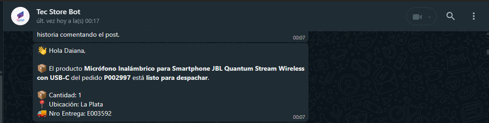
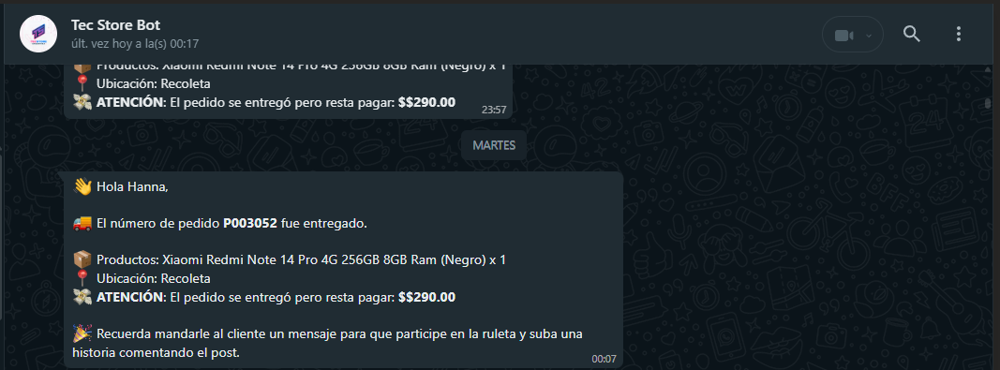

# 📦 Gestor de Pedidos para Empleados

Este bot de WhatsApp permite a los empleados de una tienda consultar el estado de los pedidos que gestionaron, recibir avisos automáticos cuando llegan productos y tener acceso a información filtrada desde una base de datos en Google Sheets.

> ✅ En uso real desde 2024 – desarrollado originalmente para Tec Store Argentina

---

## 🎯 Motivación

Este bot fue creado a partir de necesidades reales en el funcionamiento interno de **mi tienda Tec Store**, donde gestionar múltiples pedidos por día y coordinar con distintos empleados se volvía cada vez más complejo.

La problemática principal:  
Los empleados se comunicaban entre sí constantemente por WhatsApp para consultar si un pedido había llegado, dónde estaba, o si restaba pagar algo. Esto generaba errores, demoras y pérdida de control en el seguimiento.

---

## ✅ Solución

Este sistema automatiza todo ese proceso, permitiendo:

- Consultar pedidos pendientes sin molestar a otros
- Ver detalles filtrados según el empleado
- Recibir alertas automáticas cuando un producto cambia de estado (ej: de "en tránsito" a "pendiente")
- Controlar productos que faltan entregar o cobrar

---

## 📱 Cómo funciona

1. El empleado escribe al bot por WhatsApp
2. El bot le muestra botones interactivos con opciones como:
   - "Ver pedidos pendientes"
   - "Buscar pedido"
   - "Pedidos por cobrar"
3. El bot consulta una hoja de Google Sheets y devuelve los resultados filtrados
4. Si un pedido cambia de estado, el bot avisa automáticamente al responsable

---

## 💬 Ejemplo de interacción

- 👤 **Empleado**: Ver pedidos pendientes  
- 🤖 **Bot**:  
  - 📦 **Pedido**: P10234  
  - 📱 **Producto**: iPhone 13  
  - 🚚 **Estado**: En tránsito  
  - 💰 **Resta pagar**: $150.000  

---
## 🧪 Ejemplos reales de uso

A continuación se muestran capturas reales de cómo el bot notifica a los empleados por WhatsApp, ayudando a coordinar entregas sin necesidad de comunicación manual.

### 📦 Productos listos para despachar

  

El bot detecta automáticamente cuándo un producto cambia de estado a “pendiente para entregar” y envía un mensaje al empleado responsable. Incluye:

- Nombre del producto
- Pedido y número de entrega
- Ubicación actual
- Cantidad

---

### ✅ Pedidos entregados con saldo pendiente

  

Cuando un pedido se marca como entregado pero aún queda un saldo por cobrar, el bot notifica al empleado con una advertencia clara. Incluso puede sugerir que se le envíe un mensaje promocional al cliente (ej: participar en una ruleta o campaña).

---

Estas notificaciones se generan automáticamente cada 5 minutos gracias a un sistema de detección de cambios en la base de datos de Google Sheets.

## 🧠 Tecnologías utilizadas

- `whatsapp-web.js` – Para manejar los mensajes de WhatsApp
- `Google Sheets API` – Para consultar el estado de pedidos
- `Node.js` – Backend del bot
- `Railway` – Hosting en la nube
- `node-cron` – Para ejecutar chequeos automáticos de estado cada 5 minutos

---

## 📊 ¿Qué resuelve?

✅ Centraliza la información  
✅ Elimina la necesidad de comunicación constante entre empleados  
✅ Evita errores o pedidos olvidados  
✅ Mejora el seguimiento interno

---

## 🔐 Código

Este proyecto está en uso privado y el código no se encuentra publicado. Sin embargo, toda la lógica y el funcionamiento están detallados en este documento.

---

> 💬 *“Automatizamos la coordinación entre empleados sin necesidad de que nadie pregunte nada: todo llega directo por WhatsApp.”*

